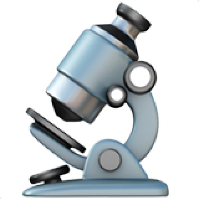

<p align="center">
  <a href="" rel="noopener">
  </a>
</p>

<h1 align="center">Zero-config environment type detection</h1>

<div align="center">

[](https://github.com/drevops/environment-detector/issues)
[](https://github.com/drevops/environment-detector/pulls)
[](https://github.com/drevops/environment-detector/actions/workflows/test-php.yml)
[](https://codecov.io/gh/drevops/environment-detector)


[](https://github.com/drevops/vortex)
</div>

---

Answers one question, with no configuration: **what kind of environment is this code running in?** It detects a single environment type - `local`, `ci`, `development`, `preview`, `stage`, or `production` - from the hosting platform or CI platform the code runs on, and also recognises the local stack (native host or container) beneath it.

- Zero configuration: a single call detects and caches the type.
- Recognises hosting platforms (Acquia, Lagoon, Pantheon, Platform.sh, Skpr, Tugboat) and CI platforms (GitHub Actions, GitLab CI, CircleCI).
- Recognises the stack it runs on (native host, Container, DDEV, Lando).
- Applies framework-specific settings through contexts (Drupal).
- Extensible with custom platforms, stacks, and contexts, with a safe fallback type.

## Installation

```bash
composer require drevops/environment-detector
```

## Quick start

```php
use DrevOps\EnvironmentDetector\Environment;

if (Environment::isProd()) {
  // Apply production settings.
}
```

The first call auto-detects and caches the result. The full set is `isLocal()`, `isCi()`, `isDev()`, `isPreview()`, `isStage()`, `isProd()`, plus `Environment::is('custom-type')` for custom types.

The detected type is also written to the `ENVIRONMENT_TYPE` environment variable:

```php
Environment::init();
if (getenv('ENVIRONMENT_TYPE') === Environment::PRODUCTION) {
  // ...
}
```

If `ENVIRONMENT_TYPE` is already set, that value wins - handy for forcing a type while debugging.

## Environment types

The built-in detectors resolve to one of these types (a custom platform can return its own, read via `Environment::is('custom-type')`):

| Type | What it is | Lifespan |
|------|-----------|----------|
| `local` | Your own machine or local stack (native host, DDEV, Lando, Docker); no hosting platform is active. | Persistent (developer-owned) |
| `ci` | An automated CI runner (GitHub Actions, GitLab CI, CircleCI). | Ephemeral, per job |
| `development` | A shared, long-lived hosting environment for ongoing integration work. Also the safe [fallback](#configuration). | Persistent |
| `preview` | A short-lived, throwaway per-branch or per-PR environment with its own fully-built site on its own standalone URL. | Ephemeral |
| `stage` | A persistent pre-production environment that mirrors production; used for UAT, QA, and release sign-off. | Persistent |
| `production` | The live environment serving real users. | Persistent |

`preview` is the only ephemeral, per-change tier with its own URL - which is what sets it apart from `development` (shared and long-lived) and `stage` (a persistent pre-production mirror).

## How it works

A run is a set of nested rings, from the outermost ring inward to the application:

```text
┌─ PLATFORM ── hosting (tiered) · CI (flat) · none ⇒ local ───────────────┐
│   ┌─ STACK ── native · container · ddev · lando ────────────────────┐   │
│   │   ┌─ RUNTIME ── PHP 8.x ────────────────────────────────────┐   │   │
│   │   │   ┌─ APP / CONTEXT ── Drupal ───────────────────────┐   │   │   │
│   │   │   └─────────────────────────────────────────────────┘   │   │   │
│   │   └─────────────────────────────────────────────────────────┘   │   │
│   └─────────────────────────────────────────────────────────────────┘   │
└─────────────────────────────────────────────────────────────────────────┘
```

- **Platform** - the outermost ring, and the *only* one that decides the type. A hosting platform maps to `production`/`stage`/`development`/`preview`; a CI platform maps to `ci`; with no platform at all the type is `local` (or `ci` when a generic `CI` signal is present).
- **Stack** - the substrate the run sits in (`native`, `container`, `ddev`, `lando`). A stack nests inside a platform, never decides the type, and only contributes settings. `ddev` and `lando` are specific containers, `container` is the generic container fallback, and `native` is the native host (bare metal), the fallback when nothing else matches.
- **Context** - the application/framework (e.g. Drupal) that detected settings are applied to.
- **Runtime** (PHP) is shown only to complete the picture; it is not detected.

Two rules follow:

1. **At most one platform is active.** Two active platforms (say Acquia *and* Lagoon) is a genuine misconfiguration and throws.
2. **Exactly one stack is always active - the most specific stack that matches, or the native host as the fallback.** A container inside Acquia or inside CI is just an inner ring; it never collides with the platform. The most specific match wins - DDEV over the generic `container`, say - and the native host is the last-resort fallback when nothing else matches.

When a context is active, it applies its generic settings first, then the active platform and the active stack apply their own on top. This happens even when the type was pre-set via `ENVIRONMENT_TYPE`.

## Configuration

`init()` is optional - the `is*()` methods initialise on first use. Call it directly only to register custom detectors or change the fallback:

```php
Environment::init(
  contextualize: TRUE,                 // Apply context settings automatically (default).
  fallback: Environment::DEVELOPMENT,  // Type used when a platform cannot resolve its tier.
  platforms: [new MyHostingPlatform()],
  stacks: [new MyStack()],
  contexts: [new MyContext()],
);
```

The fallback (`development` by default) applies only when a platform is active but cannot resolve its tier - it is never used to silently downgrade a known environment. It guards against applying local settings in production, or production settings locally.

## Platforms

A platform is the outermost ring and the only one that decides the type. Built-ins:

- [Acquia](src/Platforms/Acquia.php)
- [CircleCI](src/Platforms/CircleCi.php)
- [GitHub Actions](src/Platforms/GitHubActions.php)
- [GitLab CI](src/Platforms/GitLabCi.php)
- [Lagoon](src/Platforms/Lagoon.php)
- [Pantheon](src/Platforms/Pantheon.php)
- [Platform.sh](src/Platforms/PlatformSh.php)
- [Skpr](src/Platforms/Skpr.php)
- [Tugboat](src/Platforms/Tugboat.php)

### How platforms map to types

Each hosting platform maps its own signal to a type. `preview` is the catch-all: any environment a platform spins up that it cannot place in one of the three persistent tiers (`production`, `stage`, `development`) is treated as an ephemeral, per-branch or per-PR build.

The name-based platforms (Acquia, Pantheon, Skpr) read an environment **name** - recognised names map to a persistent tier, and any other name is a `preview`. The branch-based platforms (Lagoon, Platform.sh) type an environment as production or non-production, then resolve the exact tier from the deployed Git branch: the `develop` branch is `development`, and any other non-production, non-stage branch is a `preview`.

| Platform | Signal | `production` | `stage` | `development` | `preview` |
|----------|--------|--------------|---------|---------------|-----------|
| Acquia | `AH_SITE_ENVIRONMENT` | `prod` | `stage`, `test` | `dev` | any other name (e.g. `ode*` on-demand) |
| Pantheon | `PANTHEON_ENVIRONMENT` | `live` | `test` | `dev` | any other name (multidev) |
| Skpr | `SKPR_ENV` | `prod` | `stg` | `dev` | any other name |
| Lagoon | `LAGOON_ENVIRONMENT_TYPE` | env-type `production`, or the `ENVIRONMENT_PRODUCTION_BRANCH` branch | `main`/`master`, `release/*`, `hotfix/*` | `develop` branch | env-type `development` on any other branch |
| Platform.sh | `PLATFORM_ENVIRONMENT_TYPE` | type `production` | type `staging` | type `development` on the `develop` branch | type `development` on any other branch |
| Tugboat | `TUGBOAT_PREVIEW_ID` | - | - | - | always |

On Lagoon, `main`/`master` resolve to `stage` unless one of them is named by `ENVIRONMENT_PRODUCTION_BRANCH`, in which case it is `production`. The branch names (`main`, `master`, `release/*`, `hotfix/*`, `develop`) are built-in conventions.

Every built-in platform resolves to one of these tiers whenever it is active - an active environment it cannot place in a persistent tier (an unrecognised name or env-type) is a `preview`. The `development` [fallback](#configuration) applies only to custom platforms that return no type. The CI platforms - CircleCI, GitHub Actions, GitLab CI - always resolve to `ci`.

Read the active platform:

```php
Environment::init();

if (Environment::getActivePlatform()?->id() === 'acquia') {
  // Acquia-specific logic.
}
```

Add your own by implementing `PlatformInterface`:

```php
use DrevOps\EnvironmentDetector\Contexts\ContextInterface;
use DrevOps\EnvironmentDetector\Environment;
use DrevOps\EnvironmentDetector\Platforms\PlatformInterface;

class CustomHosting implements PlatformInterface {
  public function id(): string {
    return 'customhosting';
  }

  public function active(): bool {
    return isset($_SERVER['CUSTOM_ENV']);
  }

  public function type(): ?string {
    return match ($_SERVER['CUSTOM_ENV_TYPE'] ?? null) {
      'dev' => Environment::DEVELOPMENT,
      'qa' => 'qa',
      'live' => Environment::PRODUCTION,
      default => null,
    };
  }

  public function contextualize(ContextInterface $context): void {
    // Optional: apply platform-specific context changes.
  }
}

Environment::init(platforms: [new CustomHosting()]);
```

## Stacks

A stack is the substrate the run sits in. Stacks never decide the type. Exactly one stack is always active - the most specific stack that matches, or the native host as the last-resort fallback. `Container` is the generic container fallback, `Ddev` and `Lando` are specific containers that match only when running inside a container, and `Native` is the native host, used when nothing else matches. Built-ins:

- [Container](src/Stacks/Container.php)
- [DDEV](src/Stacks/Ddev.php)
- [Lando](src/Stacks/Lando.php)
- [Native](src/Stacks/Native.php)

Read the active stack:

```php
Environment::init();

if (Environment::getActiveStack()?->id() === 'ddev') {
  // DDEV-specific logic.
}
```

`getActiveStack()` returns the first registered stack whose `active()` matches - your custom stacks included - with the `native` host as the last-resort fallback.

Add your own by implementing `StackInterface`:

```php
use DrevOps\EnvironmentDetector\Contexts\ContextInterface;
use DrevOps\EnvironmentDetector\Stacks\StackInterface;

class CustomStack implements StackInterface {
  public function id(): string {
    return 'customstack';
  }

  public function active(): bool {
    return getenv('CUSTOM_STACK') !== false;
  }

  public function contextualize(ContextInterface $context): void {
    // Optional: apply stack-specific context changes.
  }
}

Environment::init(stacks: [new CustomStack()]);
```

## Contexts

A context is the framework or application that detected settings are applied to. The [Drupal](src/Contexts/Drupal.php) context, for example, writes to the global `$settings` array; the active platform and the active stack then layer their own changes on top (the Lagoon platform, say, adds its reverse-proxy and trusted-host settings).

Add your own by implementing `ContextInterface`:

```php
use DrevOps\EnvironmentDetector\Contexts\ContextInterface;

class CustomContext implements ContextInterface {
  public function id(): string {
    return 'myframework';
  }

  public function active(): bool {
    return class_exists('MyFramework');
  }

  public function contextualize(): void {
    global $configuration;
    $configuration['custom_value'] = $_SERVER['custom_value'] ?? 'default';
  }
}

Environment::init(contexts: [new CustomContext()]);
```

## Environment variables

Beyond the platform and stack detection signals the hosting or CI provider sets (listed in the [Platforms](#platforms) table), the detector reads a few variables that **you** set - to override detection or to shape the settings a context applies. All are optional.

| Variable | Effect | Applies to | When unset |
|----------|--------|------------|------------|
| `ENVIRONMENT_TYPE` | If set before detection, the value is used verbatim and overrides all detection (handy for forcing a type while debugging); the resolved type is written back here either way. | Core | Detection runs and populates it. |
| `CI` | When no platform is active, a truthy value resolves the type to `ci` instead of `local`. Most CI providers set it automatically. | Core | Treated as not-CI, so `local`. |
| `ENVIRONMENT_PRODUCTION_BRANCH` | Names the Git branch deployed as production: a deployed branch equal to it resolves to `production`, and it also forms the Drupal `cache_prefix`. | Lagoon | Branches are typed by built-in conventions only. |
| `DRUPAL_CONFIG_PATH` | Sets the Drupal `config_sync_directory`. | Acquia | Falls back to the Acquia-provided `config_vcs_directory`. |
| `DRUPAL_TMP_PATH` | Sets the Drupal `file_temp_path` explicitly; takes precedence over the shared path below. | Acquia | `/tmp`, or the shared path when `DRUPAL_TMP_PATH_IS_SHARED` is set. |
| `DRUPAL_TMP_PATH_IS_SHARED` | When truthy, points `file_temp_path` at the shared GFS mount (`/mnt/gfs/<group>.<env>/tmp`). | Acquia | `file_temp_path` stays `/tmp`. |
| `DRUPAL_ACQUIA_SETTINGS_FILE` | Overrides the path to the Acquia-provided `*-settings.inc` file that is included. | Acquia | `/var/www/site-php/<group>/<group>-settings.inc`. |
| `DRUPAL_ENVIRONMENT_CONTAINER_TRUSTED_HOSTS` | A comma-separated list of hostnames or URLs added as a Drupal `trusted_host_patterns` entry. | Container stack | No pattern is added. |

The `DRUPAL_*` variables take effect only when the [Drupal](#contexts) context is active.

## Maintenance

```bash
composer install
composer lint
composer test
```

---

*This repository was created using the *[*Scaffold*](https://getscaffold.dev/)*
project template.*
